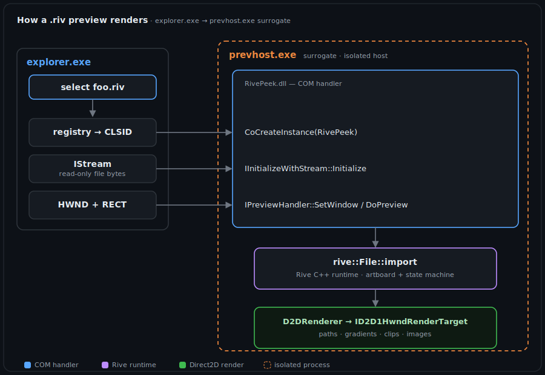

# RivePeek — Rive (`.riv`) preview handler for Windows Explorer


[](LICENSE)
[](https://github.com/ajsb85/rive-peek/releases)

RivePeek is a native Windows **Shell preview handler** that renders animated
[Rive](https://rive.app) `.riv` files live in the File Explorer preview pane —
the same mechanism Windows uses to preview PDFs, Office documents and images.

Select a `.riv` file with the preview pane open (**Alt + P**) and the default
artboard plays, fit and centered, isolated inside Windows' `prevhost.exe`
surrogate process so a malformed file can never destabilize Explorer.

It also registers an **`IThumbnailProvider`**, so `.riv` files show a static
first-frame thumbnail as their icon in the Explorer file grid.

<p align="center">
  
</p>
<p align="center"><sub>RivePeek in File Explorer — static <code>.riv</code> thumbnails in the grid and a live, animated preview pane.</sub></p>

| Headless render (`rivshot`) | Live preview pane (captured from the real COM handler) |
|---|---|
|  |  |

> Validated against **887 marketplace `.riv` files: 886 render successfully
> (99.9%)**. The single outlier is rejected as `malformed` by the Rive runtime
> itself during import.

---

## Features

- 🎬 **Animated preview pane** — the default artboard's state machine (or first
  animation) plays live while the file is selected.
- 🖼️ **Static thumbnails** — first-frame `.riv` thumbnails as grid icons via
  `IThumbnailProvider`.
- 🛡️ **Process-isolated** — runs in Windows' `prevhost.exe` surrogate; a bad
  file can't crash Explorer.
- 🪶 **Dependency-free** — only the core Rive runtime is compiled; rendering is
  pure Direct2D + WIC. The `RivePeek.dll` is self-contained (static CRT).
- 🔒 **Per-user install** — registers under `HKCU`; no administrator rights.
- 🧪 **Headless tooling** — `rivshot` renders any `.riv` to PNG and validates a
  whole corpus.

---

## How it works

Windows previews files through COM components hosted out-of-process. When you
select a `.riv` file:

1. **Explorer** reads `HKCR\.riv\ShellEx\{8895b1c6-…}` to find the preview
   handler's CLSID.
2. The handler's `AppID` points at the **`prevhost.exe`** surrogate, so Windows
   loads `RivePeek.dll` into that isolated host — not into `explorer.exe`.
3. Explorer hands the file to the handler as a read-only `IStream`
   (`IInitializeWithStream`), then gives it an `HWND` + bounding rectangle
   (`IPreviewHandler::SetWindow`) and calls `DoPreview()`.
4. RivePeek parses the file with the **Rive C++ runtime**, then draws every
   frame with a **Direct2D** renderer into a child window, advancing the default
   state machine (or first animation) on a ~30 fps timer.

<p align="center">
  
</p>

### The Direct2D backend

Rather than compiling Rive's heavyweight GPU "Rive Renderer" (and its shader /
HarfBuzz / Yoga / SheenBidi dependency chain), RivePeek implements Rive's two
abstract embedding interfaces directly on top of Direct2D + WIC:

- **`rive::Factory`** → `D2DFactory`: builds paths (`ID2D1PathGeometry`),
  solid/linear/radial brushes, and decodes images via **WIC**.
- **`rive::Renderer`** → `D2DRenderer`: maps `save`/`restore`, `transform`,
  `clipPath` (geometry-mask layers), `drawPath` (fill/stroke), `drawImage`, and
  `drawImageMesh` (per-triangle affine-textured fills) onto an
  `ID2D1RenderTarget`.

The same backend powers a **WIC bitmap render target** for headless thumbnail
generation (no GPU or window required), which doubles as the test harness.

This means only the **core** Rive runtime is compiled — no external
dependencies. Text and Yoga-based layout are `#ifdef`-guarded in the runtime and
compile to no-ops here (see [Limitations](#limitations)).

---

## Repository layout

```
src/
  guids.hpp           CLSID + registration constants
  rive_d2d.hpp/.cpp   Direct2D implementation of rive::Factory + rive::Renderer
  rive_scene.hpp/.cpp loads a .riv, instantiates artboard + state machine, draws
  preview_handler.*   the COM handler (IPreviewHandler, IInitializeWithStream,
                      IOleWindow, IObjectWithSite, IPreviewHandlerVisuals,
                      IThumbnailProvider)
  dllmain.cpp         COM class factory, DLL exports, (un)registration
  rivepeek.def        exported entry points
tools/
  rivshot.cpp         headless .riv → .png renderer / validation harness
  preview_test.cpp    in-process integration test of the full COM pipeline
  surrogate_test.cpp  out-of-process (prevhost.exe) activation test
  thumb_test.cpp      IThumbnailProvider test (.riv → thumbnail .png)
build/                MSVC build scripts (no CMake required)
install/              register.ps1 / unregister.ps1 / RivePeek.reg
rive-runtime/         Rive C++ runtime (git submodule)
```

---

## Quick start (prebuilt)

1. Download `RivePeek.dll` (and the `install` scripts) from the
   [latest release](https://github.com/ajsb85/rive-peek/releases).
2. Put `RivePeek.dll` somewhere stable, e.g. `%LOCALAPPDATA%\RivePeek\`.
3. Register it (per-user, no admin):
   ```powershell
   .\install\register.ps1 -Dll "$env:LOCALAPPDATA\RivePeek\RivePeek.dll"
   ```
4. In Explorer, press **Alt + P** for the preview pane and select a `.riv` file.

Prefer to build from source? See below.

---

## Building

Requirements: **Visual Studio 2022 Build Tools** (MSVC v143) and the **Windows
10/11 SDK**. No CMake needed — the build scripts configure the toolchain
themselves.

```bat
git clone --recurse-submodules https://github.com/ajsb85/rive-peek.git
cd rive-peek
build\build_all.bat
```

This produces, in `build\bin\`:

| Artifact | Purpose |
|---|---|
| `RivePeek.dll` | the preview + thumbnail handler (register to install) |
| `rivshot.exe` | `rivshot in.riv out.png [size] [seconds]` — headless render |
| `preview_test.exe` | drives the COM pipeline in-process and screenshots it |
| `surrogate_test.exe` | activates the handler in `prevhost.exe` (like Explorer) |
| `thumb_test.exe` | renders the `IThumbnailProvider` thumbnail to a PNG |

Individual steps: `build_rive_core.bat` (the `rive_core.lib` static lib),
`build_dll.bat`, `build_rivshot.bat`, `build_test.bat`,
`build_surrogate_test.bat`, `build_thumb_test.bat`.

> The build environment is configured by `build\env.bat`, which auto-detects the
> newest MSVC toolset and Windows SDK via `vswhere`. It deliberately avoids
> `vcvars64.bat` because that script aborts when the optional `cmake` developer
> extension is absent.

---

## Installing

Registration writes the COM class, the `.riv` association, and the
approved-preview-handlers entry under `HKEY_CURRENT_USER\Software\Classes` —
**per-user, so no administrator rights are required** (the same scheme
Microsoft's own preview-handler sample uses).

```powershell
# install
install\register.ps1

# uninstall
install\unregister.ps1
```

Equivalent manual routes: `regsvr32 build\bin\RivePeek.dll`, or edit + merge
`install\RivePeek.reg`.

After installing, open Explorer, enable the preview pane (**Alt + P**) and click
a `.riv` file. The handler is loaded by the native 64-bit
`prevhost.exe` surrogate (AppID `{6d2b5079-2f0b-48dd-ab7f-97cec514d30b}`).

---

## Testing

```powershell
# Render one file headlessly
build\bin\rivshot.exe sample.riv sample.png 512

# Exercise the entire COM handler in-process and capture the preview window
build\bin\preview_test.exe sample.riv capture.png

# Render every .riv in a folder and tally pass/fail
build\validate.ps1 -Dir "path\to\riv\files"

# Replicate Explorer's out-of-process activation (loads the handler in prevhost.exe)
build\bin\surrogate_test.exe sample.riv

# Produce the static thumbnail the file grid would show
build\bin\thumb_test.exe sample.riv thumb.png 256
```

**Diagnostics:** set the environment variable `RIVEPEEK_LOG=1` to make the
handler append a trace of each COM call (`Initialize`, `DoPreview`,
`GetThumbnail`, errors) to `%TEMP%\RivePeek.log`. It is silent otherwise.

`preview_test.exe` performs the exact sequence the Shell does
(`DllGetClassObject` → `IClassFactory::CreateInstance` → `QueryInterface` for
every required interface → `IInitializeWithStream::Initialize` → `SetWindow` →
`DoPreview`) and verifies it without needing the DLL registered.

---

## Limitations

- **Text** (`WITH_RIVE_TEXT`, HarfBuzz + SheenBidi) and **Yoga layout**
  (`WITH_RIVE_LAYOUT`) are not compiled in, so text runs are not drawn and
  layout-driven components fall back to their authored size. Vector art,
  shapes, gradients, clipping, raster images, image meshes, bones, constraints
  and state machines all render.
- **Blend modes** other than `srcOver` are drawn as `srcOver`.
- Files using a different Rive **major version** than the bundled runtime
  (currently 7) are reported as unsupported.
- Adding text/layout is a forward path: build the relevant runtime
  dependencies, define `WITH_RIVE_TEXT` / `WITH_RIVE_LAYOUT`, and implement
  `Factory::decodeFont`.

---

## Troubleshooting

| Symptom | Fix |
|---|---|
| Preview pane is blank / shows nothing | Make sure it's the **Preview** pane (Alt + P), not the **Details** pane. Re-run `install\register.ps1` (it restarts Explorer). |
| `.riv` shows a generic picture/file icon | Old thumbnail cache. Restart Explorer, or clear it: `taskkill /f /im explorer.exe & del /q "%LOCALAPPDATA%\Microsoft\Windows\Explorer\thumbcache_*.db" & start explorer`. |
| Nothing happens at all | Confirm **Folder Options ▸ View ▸ "Show preview handlers in preview pane"** is enabled. |
| Want to see what the handler is doing | Set `RIVEPEEK_LOG=1` and read `%TEMP%\RivePeek.log` — it traces every COM call. |
| Build can't overwrite `RivePeek.dll` | The DLL is loaded by a running `prevhost.exe`/Explorer. Close previews (or `taskkill /f /im prevhost.exe`) and rebuild. |

---

## Roadmap

- [x] **WiX MSI installer** (`installer/` — dual-scope per-user / per-machine,
  `WixUI_Advanced`); attached to each [release](https://github.com/ajsb85/rive-peek/releases)
- [ ] **Code-sign** the DLL and MSI (Authenticode) — the current installer is unsigned
- [ ] Text rendering (`WITH_RIVE_TEXT` — HarfBuzz + SheenBidi)
- [ ] Yoga-based layout (`WITH_RIVE_LAYOUT`)
- [ ] Full blend-mode support via Direct2D effects/`ID2D1DeviceContext`
- [ ] Pause animation when the preview pane loses focus

---

## Contributing

Contributions are welcome — see [`CONTRIBUTING.md`](CONTRIBUTING.md) for how to
build, the project layout, coding conventions, and good first issues (the
roadmap items above are all self-contained starting points).

---

## Credits & license

- Built on the [Rive C++ runtime](https://github.com/rive-app/rive-runtime)
  (MIT), included as a submodule.
- COM preview-handler structure (interface set, `QISearch` dispatch, per-user
  `HKCU` registration, prevhost surrogate AppID) follows Microsoft's canonical
  [`RecipePreviewHandler`](https://github.com/microsoft/Windows-classic-samples/tree/main/Samples/Win7Samples/winui/shell/appshellintegration/RecipePreviewHandler)
  sample.
- RivePeek itself is MIT licensed — see [`LICENSE`](LICENSE).
